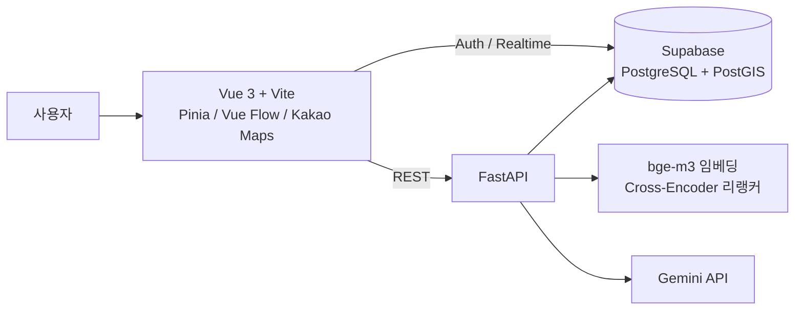
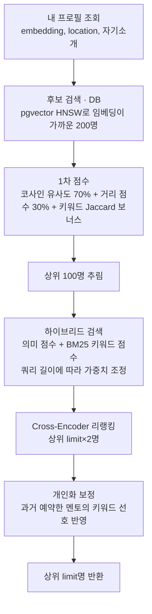
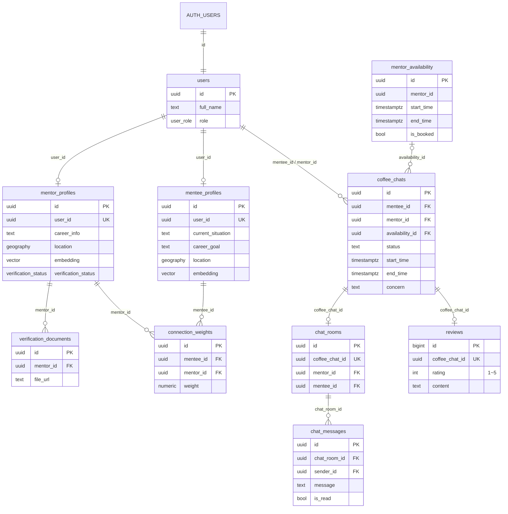

# ☕ CoffeeChat — 멘토·멘티 커피챗 매칭 플랫폼

자기소개 텍스트와 위치를 기반으로 멘토와 멘티를 추천하고, 커피챗 예약부터 채팅까지 이어 주는 웹 서비스입니다.

- **기간**: 2025.10 ~ 2025.12
- **인원**: 5명 (Frontend / Backend / AI 매칭)
- **담당 (팀장)**
  - Supabase DB 구축 및 백엔드(FastAPI) API 구현
  - AI 매칭 파이프라인 구현: 임베딩, 하이브리드 검색(BM25), Cross-Encoder 리랭킹, 개인화
  - GitHub 저장소 운영, 팀 전체 일정 관리

<br>

## 주요 기능

| 기능 | 설명 |
|---|---|
| AI 매칭 추천 | 자기소개 임베딩 유사도 + 거리 + 키워드를 합산해 상위 N명 추천 |
| 네트워크 뷰 | 멘토·멘티 관계를 그래프로 시각화 (Vue Flow) |
| 지도 뷰 | 주변 멘토를 지도에 표시 (Kakao Maps, PostGIS 반경 검색) |
| 커피챗 예약 | 멘토가 등록한 가능 시간 슬롯에 예약 → 승인/거절 |
| 실시간 채팅 | 예약 승인 시 채팅방 생성, Supabase Realtime 구독 |
| AI 자기소개 생성 | 설문 응답을 바탕으로 Gemini가 자기소개 초안 생성 |

<br>

## 아키텍처



<br>

## 매칭 파이프라인

`GET /api/matching/find-matches-advanced` 한 번의 요청이 아래 단계를 순서대로 거칩니다.



| 단계 | 구현 위치 | 핵심 |
|---|---|---|
| 임베딩 생성 | `services/ml_service.py` | `BAAI/bge-m3` (1024차원, 정규화). 전처리 후 커리어 키워드를 덧붙여 임베딩 |
| 후보 검색 | DB 함수 `match_candidates` | `ORDER BY embedding <=> q LIMIT 200`, HNSW 인덱스. API 서버가 전체 프로필을 읽지 않음 |
| 1차 점수 | `services/matching_service.py` | Haversine 거리 → 비선형 점수 변환, 텍스트·거리 가중 평균 |
| 하이브리드 | `services/hybrid_search_service.py` | BM25 직접 구현. 한글은 bigram 토큰화로 조사 차이 흡수 |
| 리랭킹 | `services/reranking_service.py` | 다국어 Cross-Encoder(`bge-reranker-v2-m3`)로 재평가, 시그모이드로 0~100 정규화 |
| 개인화 | `services/feedback_service.py` | 예약 이력 3건 이상일 때만 키워드 선호 보너스 적용 |
| 임베딩 일괄 재생성 | `regenerate_embeddings_enhanced.py` | 전처리 로직 변경 시 전체 프로필 임베딩 재계산 |

모든 단계는 `final_score` 하나를 갱신하고 다음 단계가 이어받습니다. 자기소개를 수정하면 텍스트와 임베딩을 한 번의 UPDATE로 함께 갱신합니다.

<br>

## 데이터 모델

Supabase(PostgreSQL) 위에 **pgvector**(임베딩 유사도)와 **PostGIS**(반경 검색)를 함께 사용합니다. 전체 DDL은 [`docs/schema.sql`](docs/schema.sql)에 있습니다.



| 테이블 | 역할 |
|---|---|
| `users` | `auth.users`와 1:1, 이름과 역할(mentor/mentee) |
| `mentor_profiles` / `mentee_profiles` | 역할별 프로필, 자기소개, `embedding`(vector), `location`(geography) |
| `mentor_availability` | 멘토의 예약 가능 시간 슬롯 |
| `coffee_chats` | 예약 (멘티, 멘토, 슬롯, 상태: pending/approved/rejected) |
| `chat_rooms` / `chat_messages` | 승인된 예약당 채팅방 1개와 메시지 |
| `reviews` | 예약당 후기 1개, 평점 1~5 (CHECK 제약) |
| `user_likes` | 멘토 찜 (사용자-멘토 쌍 UNIQUE) |
| `connection_weights` | 멘티-멘토 연결 가중치 (현재 미사용) |
| `verification_documents` | 멘토 인증 서류 |

DB 함수: `match_candidates` / `match_mentors`(pgvector 코사인 유사도), `nearby_mentors`(PostGIS `ST_DWithin` 반경 검색), `update_mentor_location` / `update_mentee_location`(좌표 → geography).

**무결성·보안**
- 예약: 조건부 UPDATE로 슬롯 선점, `availability_id` UNIQUE로 중복 예약 차단, `status` CHECK
- 인덱스: 조회 패턴에 맞춘 복합 B-tree, 위치 GiST, 임베딩 HNSW
- RLS: 전 테이블 활성화, 프론트가 직접 쓰는 작업에만 최소 정책. 쓰기는 백엔드 API가 담당

스키마 기준본은 [`docs/schema.sql`](docs/schema.sql), 변경 이력은 [`docs/migrations/`](docs/migrations)에 있습니다.

<br>

## 기술 스택

| 구분 | 기술 |
|---|---|
| Backend | Python, FastAPI, Pydantic |
| DB | Supabase (PostgreSQL, PostGIS, Auth, Realtime) |
| AI / 검색 | sentence-transformers (`BAAI/bge-m3`, `BAAI/bge-reranker-v2-m3`), pgvector(HNSW), BM25(직접 구현), Google Gemini |
| Test / CI | pytest, GitHub Actions |
| Frontend | Vue 3, Vite, Pinia, Vue Router, Vue Flow, Kakao Maps, V-Calendar |

<br>

## 실행 방법

### Backend

```bash
cd backend
python -m venv .venv
source .venv/bin/activate        # Windows: .venv\Scripts\activate
pip install -r requirements.txt
cp .env.example .env             # 값 채우기
python main.py                   # http://127.0.0.1:8000  (API 문서: /docs)
```

> 첫 실행 시 `bge-m3`와 리랭커 모델을 내려받습니다 (합계 수 GB).

### DB 마이그레이션

Supabase SQL Editor에서 순서대로 실행합니다.

1. `docs/migrations/000_precheck.sql`: 결과가 모두 0행인지 확인 (읽기 전용)
2. `docs/migrations/001_integrity_and_indexes.sql`: 제약·인덱스·`match_candidates` 함수 (트랜잭션)
3. `docs/migrations/002_rls.sql`: RLS 정책 (트랜잭션)

### 테스트

```bash
cd backend
pip install -r requirements-dev.txt
pytest -q
```

가짜 Supabase 클라이언트(`tests/fake_supabase.py`)로 DB 없이 예약 동시성, 권한 범위, 매칭 파이프라인을 검증합니다. 모델과 torch는 `tests/conftest.py`에서 가짜 모듈로 대체합니다.

### Frontend

```bash
cd frontend
npm install
cp .env.example .env             # 값 채우기
npm run dev                      # http://localhost:5173
```

<br>

## 폴더 구조

```
coffeechat/
├── backend/
│   ├── main.py                  # FastAPI 앱, CORS, 라우터 등록
│   ├── app/
│   │   ├── api/                 # 라우터 (auth, matching, bookings, chat, location ...)
│   │   ├── services/            # 매칭·검색·리랭킹·개인화 로직
│   │   └── core/config.py       # 환경변수, Supabase 클라이언트
│   ├── tests/                   # pytest (가짜 Supabase 클라이언트)
│   └── regenerate_embeddings_enhanced.py
├── frontend/
│   └── src/ (views, components, store, services, router)
├── docs/
│   ├── schema.sql               # DB 스키마 기준본
│   ├── migrations/              # 000 점검 → 001 무결성·인덱스 → 002 RLS
│   ├── CHANGES.md               # 리팩터링 기록 (문제·원인·변경)
│   └── frontend-guide.md        # 팀 내부 프론트엔드 구조 가이드
└── .github/workflows/ci.yml     # 백엔드 테스트 + 프론트 빌드
```

<br>

## 한계와 개선 방향

프로젝트 종료 후 진행한 리팩터링 내용은 [`docs/CHANGES.md`](docs/CHANGES.md)에 정리했습니다.

- **평가 체계**: 매칭 품질을 정량적으로 측정하는 오프라인 평가 셋과 지표가 아직 없습니다.
- **FK 참조 대상 통일**: 테이블마다 멘토를 `users.id` / `mentor_profiles.id`로 다르게 참조합니다.
- **배포**: Docker 기반 실행 환경이 없습니다.
