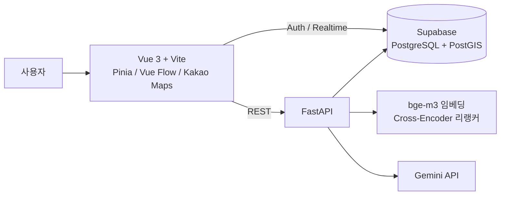
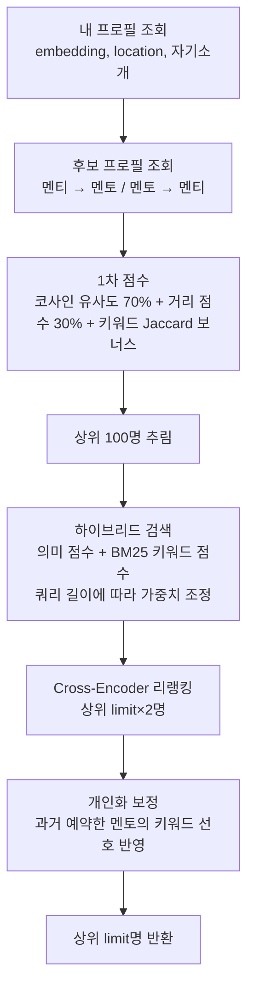

# ☕ CoffeeChat — 멘토·멘티 커피챗 매칭 플랫폼

자기소개 텍스트와 위치를 기반으로 멘토와 멘티를 추천하고, 커피챗 예약부터 채팅까지 이어 주는 웹 서비스입니다.

- **기간**: 2025.10 ~ 2025.12
- **인원**: 5명 (Frontend / Backend / AI 매칭)
- **담당 (팀장)**
  - Supabase DB 구축 및 백엔드(FastAPI) API 구현
  - AI 매칭 파이프라인 구현: 임베딩, 하이브리드 검색(BM25), Cross-Encoder 리랭킹, 개인화
  - GitHub 저장소 운영, 팀 전체 일정 관리

<br>

## 주요 기능

| 기능 | 설명 |
|---|---|
| AI 매칭 추천 | 자기소개 임베딩 유사도 + 거리 + 키워드를 합산해 상위 N명 추천 |
| 네트워크 뷰 | 멘토·멘티 관계를 그래프로 시각화 (Vue Flow) |
| 지도 뷰 | 주변 멘토를 지도에 표시 (Kakao Maps, PostGIS 반경 검색) |
| 커피챗 예약 | 멘토가 등록한 가능 시간 슬롯에 예약 → 승인/거절 |
| 실시간 채팅 | 예약 승인 시 채팅방 생성, Supabase Realtime 구독 |
| AI 자기소개 생성 | 설문 응답을 바탕으로 Gemini가 자기소개 초안 생성 |

<br>

## 아키텍처



<br>

## 매칭 파이프라인

`GET /api/matching/find-matches-advanced` 한 번의 요청이 아래 단계를 순서대로 거칩니다.



| 단계 | 구현 위치 | 핵심 |
|---|---|---|
| 임베딩 생성 | `services/ml_service.py` | `BAAI/bge-m3` (1024차원, 정규화). 전처리 후 커리어 키워드를 덧붙여 임베딩 |
| 1차 점수 | `services/matching_service.py` | Haversine 거리 → 비선형 점수 변환, 텍스트·거리 가중 평균 |
| 하이브리드 | `services/hybrid_search_service.py` | BM25를 직접 구현해 의미 점수와 가중 결합 |
| 리랭킹 | `services/reranking_service.py` | 질의-후보 쌍을 Cross-Encoder로 재평가 |
| 개인화 | `services/feedback_service.py` | 예약 이력 3건 이상일 때만 키워드 선호 보너스 적용 |
| 임베딩 일괄 재생성 | `regenerate_embeddings_enhanced.py` | 전처리 로직 변경 시 전체 프로필 임베딩 재계산 |

자기소개를 수정하면 해당 사용자의 임베딩이 자동으로 다시 계산됩니다.

<br>

## 데이터 모델

코드에서 사용하는 테이블입니다. (Supabase / PostgreSQL)

| 테이블 | 역할 |
|---|---|
| `users` | 공통 사용자 정보 (이름, 역할: mentor/mentee) |
| `mentor_profiles` / `mentee_profiles` | 역할별 프로필, 자기소개, `embedding`, `location`(PostGIS geography) |
| `mentor_availability` | 멘토의 예약 가능 시간 슬롯 |
| `coffee_chats` | 예약 (멘티, 멘토, 슬롯, 상태: pending/approved/rejected) |
| `chat_rooms` / `chat_messages` | 승인된 예약의 채팅방과 메시지 |
| `reviews`, `user_likes`, `user_interactions` | 후기, 찜, 상호작용 로그 |

<!-- TODO(본인): Supabase에서 스키마를 export해 docs/schema.sql로 추가하고, ERD 이미지를 여기에 첨부
     pg_dump --schema-only --no-owner -n public "$DATABASE_URL" > docs/schema.sql -->

<br>

## 기술 스택

| 구분 | 기술 |
|---|---|
| Backend | Python, FastAPI, Pydantic |
| DB | Supabase (PostgreSQL, PostGIS, Auth, Realtime) |
| AI / 검색 | sentence-transformers (`BAAI/bge-m3`, Cross-Encoder), BM25(직접 구현), Google Gemini |
| Frontend | Vue 3, Vite, Pinia, Vue Router, Vue Flow, Kakao Maps, V-Calendar |

<br>

## 실행 방법

### Backend

```bash
cd backend
python -m venv .venv
source .venv/bin/activate        # Windows: .venv\Scripts\activate
pip install -r requirements.txt
cp .env.example .env             # 값 채우기
python main.py                   # http://127.0.0.1:8000  (API 문서: /docs)
```

> 첫 실행 시 `bge-m3`(약 2GB)와 Cross-Encoder 모델을 내려받습니다.

### Frontend

```bash
cd frontend
npm install
cp .env.example .env             # 값 채우기
npm run dev                      # http://localhost:5173
```

<br>

## 폴더 구조

```
coffeechat/
├── backend/
│   ├── main.py                  # FastAPI 앱, CORS, 라우터 등록
│   ├── app/
│   │   ├── api/                 # 라우터 (auth, matching, bookings, chat, location ...)
│   │   ├── services/            # 매칭·검색·리랭킹·개인화 로직
│   │   └── core/config.py       # 환경변수, Supabase 클라이언트
│   └── regenerate_embeddings_enhanced.py
├── frontend/
│   └── src/ (views, components, store, services, router)
└── docs/
    └── frontend-guide.md        # 팀 내부 프론트엔드 구조 가이드
```

<br>

## 한계와 개선 방향

- **후보 조회 방식**: 현재는 후보 프로필 전체를 가져와 애플리케이션에서 점수를 계산합니다. 사용자가 늘어나면 pgvector 인덱스와 PostGIS 거리 필터로 DB 단계에서 후보를 좁히는 구조가 필요합니다.
- **평가 체계**: 매칭 품질을 정량적으로 측정하는 오프라인 평가 셋과 지표가 아직 없습니다.
- **테스트·배포**: 자동화 테스트와 Docker 기반 실행 환경이 없습니다.
